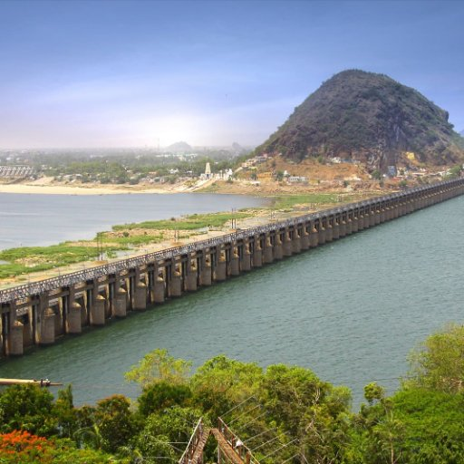

# shashanka ravi chaparala
My name is shashanka ravi, I am from choutuppal which is 40 miles away from hyderabad city and i did my bachelors in electronics and communication engineering from Vignan institute of technology and science which is located in Deshmukhi.After my bachelors i worked as a support engineer in primera company.I have taken computer background in masters because my aim is to become Full stack developer.

This picture depicts the Vijayawada 